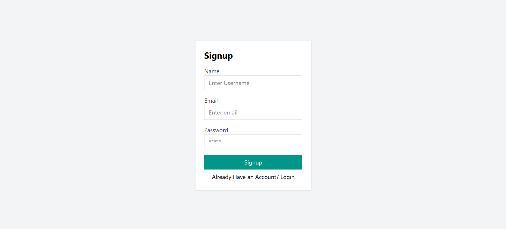
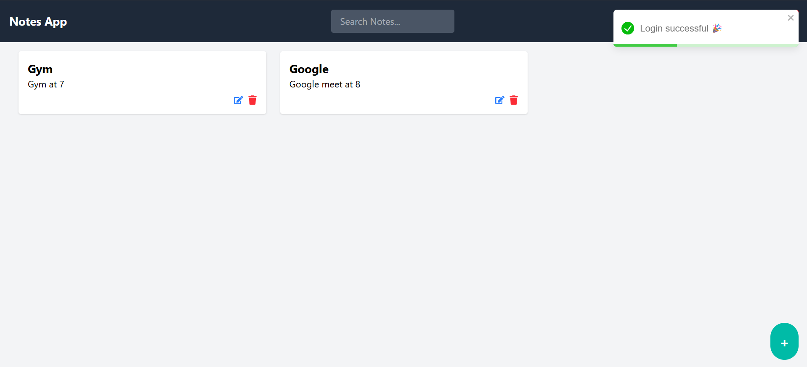
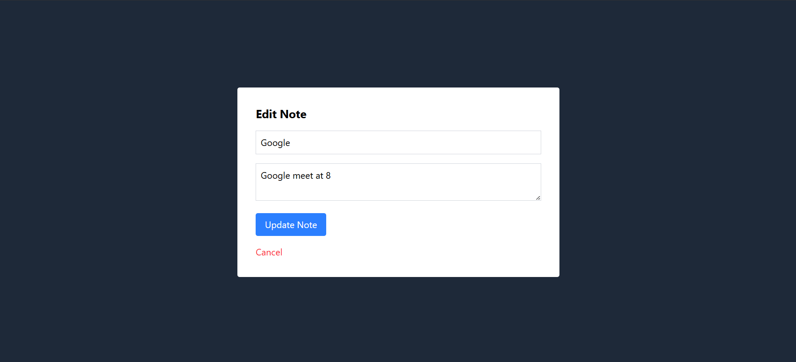

# 📝 Notes App (MERN Stack)

A full-stack **Notes Management Application** built using the **MERN stack (MongoDB, Express, React, Node.js)**.  
This is my first personal MERN project 🚀, where users can **register, log in, and manage notes** securely with an intuitive UI.

---

## ✨ Features

- 🔑 **Authentication & Authorization** with JWT & bcrypt
- 📝 Full **CRUD** operations on notes (Create, Read, Update, Delete)
- 🔍 **Search & Filter** notes in real-time
- 🎨 Modern, responsive **UI with React + Tailwind CSS**
- 🔔 **Toast notifications** for actions (login, signup, add/edit/delete/logout)
- 🗄️ **MongoDB** for scalable data storage
- ⚡ RESTful APIs built with Express.js

---

## 🛠️ Tech Stack

**Frontend:**
- React
- Tailwind CSS
- React Router
- Axios
- React Toastify

**Backend:**
- Node.js
- Express.js
- JWT (JSON Web Tokens)
- Bcrypt.js

**Database:**
- MongoDB with Mongoose ODM

---

## 📂 Project Structure
```
📦 notes-app
├── 📁 client # React frontend
│ ├── 📁 src
│ │ ├── 📁 components # Navbar, NoteCard, NoteModel etc.
│ │ ├── 📁 context # Auth context provider
│ │ ├── 📁 pages # Signup, Login, Home
│ │ └── App.js
│ └── package.json
├── 📁 server # Express backend
│ ├── 📁 db # MongoDB connection
│ ├── 📁 middleware
│ ├── 📁 models # User & Note schema
│ ├── 📁 routes # auth & note routes
│ └── server.js
└── README.md
```

---

## 🚀 Getting Started

Follow these steps to run the project locally:

### 1. Clone the repository
```bash
git clone https://github.com/aryandas2911/Notes-App-MERN-Stack.git
cd notes-app
```

### 2.Install dependencies
```
cd frontend
npm install
cd ../server
npm install
```

### 3. Run the development servers
```
cd server
npm run dev
cd ../frontend
npm start
```

---

## 📸 Screenshots


### 1. Signup Page


### 2. Home Page


### 3. Edit Note


---

## 🔮 Future Improvements

1. 🌙 Dark Mode support
2. 📌 Pin / Favorite notes
3. 🏷️ Categories & Tags for notes
4. 🔍 Advanced search (by date, tags, etc.)
5. 📱 Mobile-friendly PWA support
6. 🌐 Deployment on Vercel (frontend) + Render/Heroku (backend)

---

## 🤝 Contributing

Contributions are welcome!
If you’d like to improve this project:-
1. Fork the repo
2. Create a new branch (feature/new-feature)
3. Commit your changes
4. Open a Pull Request
